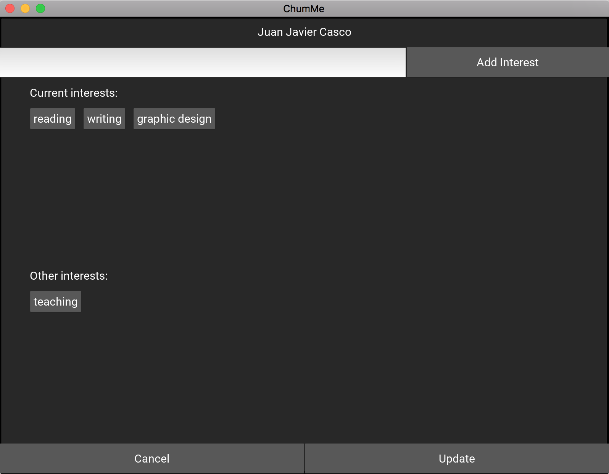
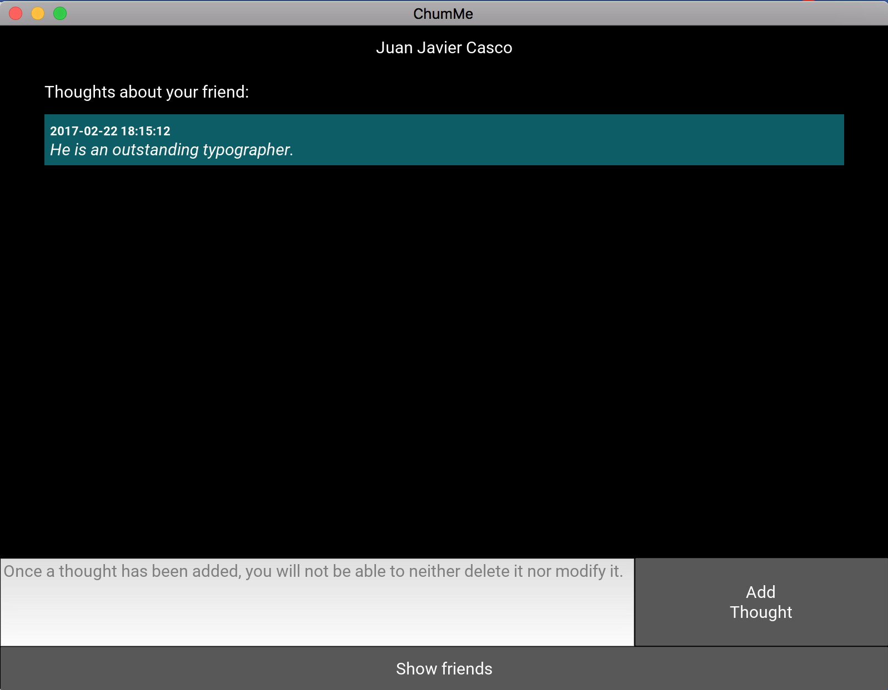

# chumme
This is an application to track the information of your friends.

# Screenshots
1. List of friends

2. Add friend form

3. Friend's general information

4. Update friend form

5. Friend's interests
    5.1 No Interests
    
    5.2 Interests
    
6. Add friend's interests
    6.1 No Interests
    
    6.2 Interests
    
7. Thoughts about friend

